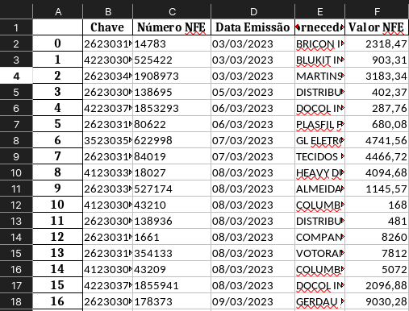
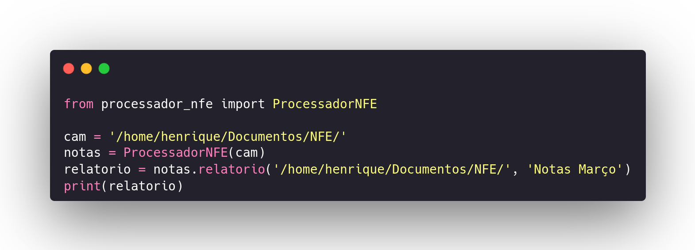

# Processador-XML

Script que filtra arquivos .XML que definem uma NFE e extrai algumas informações gerando um
arquivo do tipo .xlsx (Excel).

### Informações extraidas

- Chave de Acesso da NFE
- Número da NFE
- Data da Emissão
- Nome do Fornecedor
- Valor Total da NFE

### Relatório Gerado



### Instalação

- Linux/Mac:

```python3 -m venv venv```

```source venv/bin/activate```

```pip install Processador-XML-NFE```

- Windows:

```virtaulenv venv```

```venv/Scripts/Activate```

```pip install Processador-XML-NFE```

### Exemplo de uso


